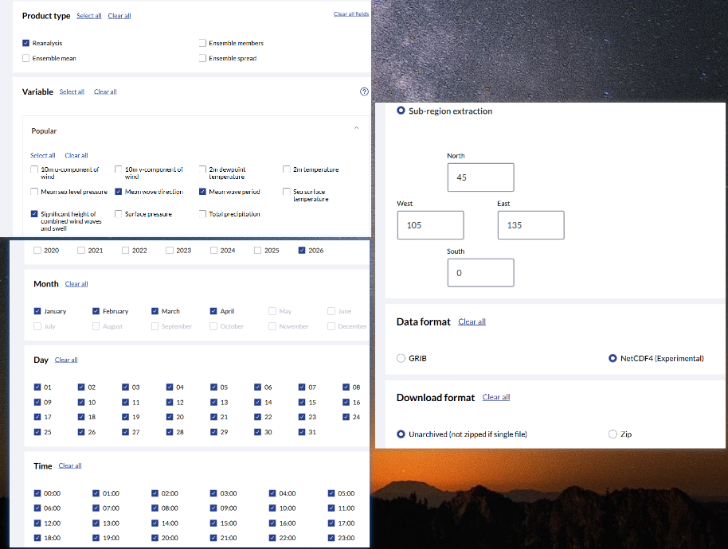
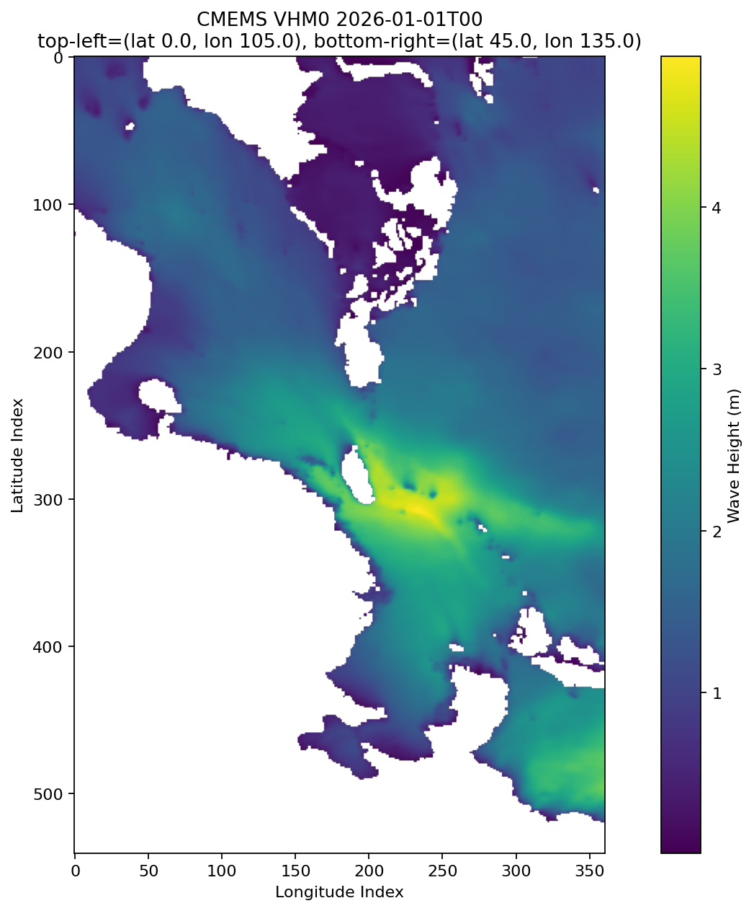
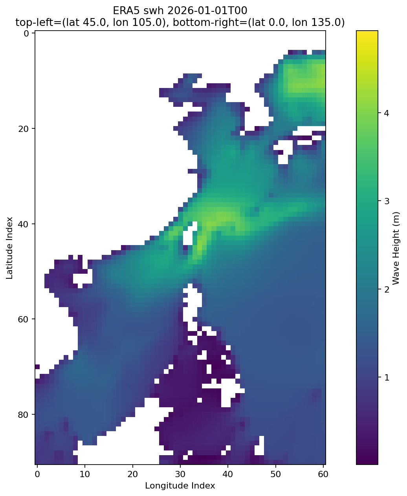

# Repository Scope

[中文](./README.md) | [English](./README_EN.md)

This repository mainly serves the data preparation stage for research on ocean physical field super-resolution.

It should also be noted that this repository currently only targets the following study area:

- Minimum latitude: `0`
- Maximum latitude: `45`
- Minimum longitude: `105`
- Maximum longitude: `135`

Therefore, all downloaded, split, aligned, and paired data in this repository are organized around this region by default.

This repository is responsible for:

- Downloading relevant datasets
- Splitting raw `nc` files into `npy` files for later processing
- Preparing the necessary spatial and temporal alignment between ERA5 and CMEMS
- Generating paired samples for later research

This repository does not cover later stages such as:

- Neural network design and training
- Downstream task construction and evaluation
- Deployment and usage of numerical simulation models
- Full production-grade engineering implementation

More precisely, this repository is intended to:

- Provide dataset download, processing, and paired-sample preparation workflows for ocean physical field super-resolution research

# CMEMS Wave Download

This project is already wired up with `copernicusmarine`, and can directly download the following three variables from these two products:

- `GLOBAL_ANALYSISFORECAST_WAV_001_027`
- `GLOBAL_MULTIYEAR_WAV_001_032`
- Fixed variables: `VMDR`, `VTM10`, `VHM0`

CMEMS product portal:

- [Copernicus Marine Products](https://data.marine.copernicus.eu/products)

The dataset IDs used in actual downloads are:

- `GLOBAL_ANALYSISFORECAST_WAV_001_027`
- `GLOBAL_MULTIYEAR_WAV_001_032`

Default download location:

- `./downloads`
- Avoid Chinese characters in the path, otherwise the download may fail

## Usage

The example commands below all use the following default parameters:

- Username: `your_username`
- Password: `your_password`
- Minimum latitude: `0`
- Maximum latitude: `45`
- Minimum longitude: `105`
- Maximum longitude: `135`
- Start time: `2026-01-01T00:00:00Z`
- End time: `2026-05-01T00:00:00Z`

The download script requires UTC timestamps with a trailing `Z`, such as `2026-01-01T00:00:00Z`.

`cmd`:

```cmd
set CMEMS_USERNAME=your_username
set CMEMS_PASSWORD=your_password
uv run python .\scripts\download_cmems_waves.py ^
  --min-lon 105 ^
  --max-lon 135 ^
  --min-lat 0 ^
  --max-lat 45 ^
  --start 2026-01-01T00:00:00Z ^
  --end 2026-05-01T00:00:00Z ^
  --output-dir .\downloads
```

`pwsh`:

```powershell
$env:CMEMS_USERNAME="your_username"
$env:CMEMS_PASSWORD="your_password"
uv run python .\scripts\download_cmems_waves.py `
  --min-lon 105 `
  --max-lon 135 `
  --min-lat 0 `
  --max-lat 45 `
  --start 2026-01-01T00:00:00Z `
  --end 2026-05-01T00:00:00Z `
  --output-dir .\downloads
```

`bash`:

```bash
export CMEMS_USERNAME="your_username"
export CMEMS_PASSWORD="your_password"
uv run python ./scripts/download_cmems_waves.py \
  --min-lon 105 \
  --max-lon 135 \
  --min-lat 0 \
  --max-lat 45 \
  --start 2026-01-01T00:00:00Z \
  --end 2026-05-01T00:00:00Z \
  --output-dir ./downloads
```

If you prefer passing the credentials directly on the command line, that is also supported:

```powershell
uv run python .\scripts\download_cmems_waves.py `
  --username "your_username" `
  --password "your_password" `
  --min-lon 105 `
  --max-lon 135 `
  --min-lat 0 `
  --max-lat 45 `
  --start 2026-01-01T00:00:00Z `
  --end 2026-05-01T00:00:00Z
```

To download only one product:

```powershell
uv run python .\scripts\download_cmems_waves.py `
  --products GLOBAL_MULTIYEAR_WAV_001_032 `
  --min-lon 105 `
  --max-lon 135 `
  --min-lat 0 `
  --max-lat 45 `
  --start 2026-01-01T00:00:00Z `
  --end 2026-05-01T00:00:00Z
```

## Download Output

- The downloaded file format is NetCDF, with extension `.nc`
- The default download directory is `./downloads`
- If `--output-dir` is provided, files will be written to the specified directory
- After a successful run, the script prints the full output path of each file

Default filename patterns:

```text
analysisforecast_start_end_lon_minlon_maxlon_lat_minlat_maxlat.nc
multiyear_start_end_lon_minlon_maxlon_lat_minlat_maxlat.nc
```

For example:

```text
./downloads/analysisforecast_20260101T000000_20260501T000000_lon105_135_lat0_45.nc
./downloads/multiyear_20260101T000000_20260501T000000_lon105_135_lat0_45.nc
```

## Optional Arguments

- `--username`: CMEMS username, or environment variable `CMEMS_USERNAME`
- `--password`: CMEMS password, or environment variable `CMEMS_PASSWORD`
- `--overwrite`: overwrite existing files
- `--skip-existing`: skip if the target file already exists
- `--dry-run`: validate the request without downloading
- `--no-progress`: disable the progress bar

## NC to NPY

The script `./scripts/split_nc_to_npy.py` splits an `.nc` file into a batch of `.npy` files along the time dimension.

- Each `.npy` file corresponds to one timestamp and one variable
- Filenames follow the format `2026-01-01T00.npy`
- Data are converted to `float32`
- Missing values remain `NaN`
- The default output root is `./data`, and the final output path is automatically expanded to `./data/nc_filename/variable_name/`
- Each `.npy` file has shape `(latitude_count, longitude_count)`
- Variables are stored in separate directories: `VMDR`, `VTM10`, `VHM0`

For example, given the input file:

```text
./downloads/analysisforecast_20260101T000000_20260501T000000_lon105_135_lat0_45.nc
```

The default output will be:

```text
./data/analysisforecast_20260101T000000_20260501T000000_lon105_135_lat0_45/
```

With a structure like:

```text
./data/analysisforecast_20260101T000000_20260501T000000_lon105_135_lat0_45/
  VMDR/
    2025-12-31T18.npy
    2025-12-31T21.npy
  VTM10/
    2025-12-31T18.npy
    2025-12-31T21.npy
  VHM0/
    2025-12-31T18.npy
    2025-12-31T21.npy
```

`pwsh` example:

```powershell
uv run python .\scripts\split_nc_to_npy.py `
  .\downloads\analysisforecast_20260101T000000_20260501T000000_lon105_135_lat0_45.nc
```

If you specify an output root directory, the nc filename is still appended automatically:

```powershell
uv run python .\scripts\split_nc_to_npy.py `
  .\downloads\analysisforecast_20260101T000000_20260501T000000_lon105_135_lat0_45.nc `
  --output-dir .\my_npy_data
```

The final output path will then be:

```text
./my_npy_data/analysisforecast_20260101T000000_20260501T000000_lon105_135_lat0_45/
```

# ERA5

## Downloading ERA5 Data

ERA5 dataset download page:

- [ERA5 single levels dataset](https://cds.climate.copernicus.eu/datasets/reanalysis-era5-single-levels?tab=download)

Illustration of the download page:



This project does not use the official ECMWF/CDS SDK to download ERA5. The reason is that ERA5-style datasets often involve queues and review steps, and the SDK workflow is not convenient enough here. Instead, this repository assumes the `.nc` file is downloaded manually from the website and then processed with the scripts in this project.

## NC to NPY

The structure of ERA5 `nc` files is different from CMEMS `nc` files. The main difference is that the time dimension is named `valid_time` instead of `time`. Therefore, a dedicated ERA5 splitting script is provided:

- `./scripts/split_era5_nc_to_npy.py`

Its output path structure is consistent with the CMEMS script:

```text
./data/era5_nc_filename/variable_name/timestamp.npy
```

For example, for the current downloaded file:

```text
./downloads/df44a36af69b40d1e1fa386759c08acc.nc
```

The ERA5 variables are:

- `mwd`
- `mwp`
- `swh`

The default output will look like:

```text
./data/df44a36af69b40d1e1fa386759c08acc/
  mwd/
    2026-01-01T00.npy
    2026-01-01T01.npy
  mwp/
    2026-01-01T00.npy
    2026-01-01T01.npy
  swh/
    2026-01-01T00.npy
    2026-01-01T01.npy
```

Each `.npy` file:

- corresponds to one timestamp and one variable
- has shape `(latitude_count, longitude_count)`
- has dtype `float32`
- keeps missing values as `NaN`

`pwsh` example:

```powershell
uv run python .\scripts\split_era5_nc_to_npy.py `
  .\downloads\df44a36af69b40d1e1fa386759c08acc.nc
```

If you specify an output root directory, the nc filename is still appended automatically:

```powershell
uv run python .\scripts\split_era5_nc_to_npy.py `
  .\downloads\df44a36af69b40d1e1fa386759c08acc.nc `
  --output-dir .\my_era5_data
```

# ERA5 and CMEMS Variable Mapping

From the standpoint of variable definition, the following ERA5 variables can be mapped to the corresponding CMEMS wave variables:

- `swh` ↔ `VHM0`
- `mwp` ↔ `VTM10`
- `mwd` ↔ `VMDR`

Specifically:

- `swh` and `VHM0` both represent significant wave height
- `mwp` and `VTM10` both represent mean wave period
- `mwd` and `VMDR` both represent mean wave direction

So in terms of variable category and physical meaning, these three pairs are aligned.

However, even if the definitions are aligned, ERA5 and CMEMS still differ in model formulation, spatial resolution, temporal resolution, and assimilation scheme. Therefore, the numerical values will not be identical.

# Spatiotemporal Alignment Between ERA5 and CMEMS

Before comparing, merging, or modeling ERA5 and CMEMS data together, spatiotemporal alignment is required.

## Spatial Alignment

The first step in spatial alignment is to request the same geographic range when downloading the data.

- ERA5 downloads should use the target latitude/longitude range
- CMEMS downloads should use the same latitude/longitude range

Only then will the two datasets cover the same geographic region after being split into `npy` files.

### Latitude/Longitude Alignment

Even if the same geographic range is requested, ERA5 and CMEMS do not store latitude/longitude in exactly the same array order.

The following two images use the same variable type at the same timestamp:

- ERA5: `swh`
- CMEMS: `VHM0`

Images:





From the coordinates in the original `nc` files, we can confirm:

- In CMEMS, array `[0,0]` corresponds to minimum latitude and minimum longitude
- In ERA5, array `[0,0]` corresponds to maximum latitude and minimum longitude

That means longitude ordering is the same, but latitude ordering is reversed.

Since each current `.npy` file has shape:

- `(latitude_count, longitude_count)`

to compare ERA5 and CMEMS under the same geographic orientation, ERA5 must be flipped vertically.

Here, “vertical flip” means:

- flip along the first array dimension
- that is, the latitude dimension
- in `(H, W)` terms, flip `H`, not `W`

After this operation, the top-left geographic orientation of ERA5 becomes consistent with CMEMS.

### Shape Alignment

After handling the latitude/longitude orientation above, the next issue is array shape.

The current shapes of individual `.npy` files are:

- ERA5: `(91, 61)`
- CMEMS reanalysis: `(225, 151)`
- CMEMS forecast: `(541, 361)`

All of them mean:

- `(latitude_count, longitude_count)`

In terms of spatial resolution:

- ERA5 is about `0.5°`
- CMEMS forecast is about `1/12°`
- CMEMS reanalysis is about `0.2°`

So after fixing the ERA5 flip, ERA5 and CMEMS still have integer or near-integer sampling-density relationships in space.

For CMEMS forecast:

- ERA5 shape is `(91, 61)`
- CMEMS forecast shape is `(541, 361)`
- If the row and column corresponding to the maximum latitude and maximum longitude are removed:
- ERA5 becomes `(90, 60)`
- CMEMS forecast becomes `(540, 360)`
- The resulting scale relationship is exactly `6x`

For CMEMS reanalysis:

- ERA5 shape is `(91, 61)`
- CMEMS reanalysis shape is `(225, 151)`
- The currently downloaded CMEMS reanalysis latitude range is `0.2°` to `45.0°`
- This means it does not start at `0.0°` as expected
- At the moment, the download script itself does not appear to be wrong; however, why CMEMS reanalysis starts at `0.2°` is still unclear

In practice, ERA5 and CMEMS reanalysis can still be aligned as follows:

- remove the ERA5 row corresponding to `0.0°` in latitude
- remove the column corresponding to the maximum longitude

After that:

- ERA5 latitude goes from `91` to `90`
- CMEMS reanalysis latitude remains `225`
- The latitude-direction scale becomes exactly `2.5x`

At the same time:

- ERA5 longitude goes from `61` to `60`
- CMEMS reanalysis longitude goes from `151` to `150`
- The longitude-direction scale also becomes exactly `2.5x`

Therefore, after coordinate alignment, this cropping strategy is acceptable for ERA5 and CMEMS reanalysis.

### Notes

- If the same ERA5 sample is aligned separately to CMEMS reanalysis and CMEMS forecast using the strategy of deleting the maximum-latitude and maximum-longitude row/column, an engineering issue appears:
- The same ERA5 data must be cropped differently for the two CMEMS products
- This means two different processed versions of ERA5 must be stored

Therefore, another acceptable engineering option is:

- consistently remove the minimum-latitude and minimum-longitude row/column from ERA5

This is still acceptable in practice and allows only one processed ERA5 version to be maintained.

This repository also provides a sample alignment script for `npy` files:

- `./scripts/align_example_npy_shapes.py`

It applies the agreed processing steps to three input samples and writes the results to `./tmp`, producing three already shape-aligned `npy` files.

## Temporal Alignment

The first step in temporal alignment is to request the same time range when downloading the data.

- ERA5 downloads should use the target time range
- CMEMS downloads should use the same time range

However, matching the same start and end time is not sufficient, because the two datasets have different temporal resolutions:

- CMEMS currently uses 3-hour resolution
- ERA5 uses 1-hour resolution

Therefore, after downloading and splitting, a time intersection still needs to be taken.

That means the timestamps actually used for comparison should be:

- timestamps present in the ERA5 `npy` set
- timestamps present in the CMEMS `npy` set

Only after this step are the two datasets truly aligned in time.

# Notes on Neural Networks

This section is mainly intended for anyone who wants to continue using this data-processing workflow.

- `LR` can be understood as ERA5
- `HR` can be understood as the two CMEMS products

## Normalization

For physical fields, I prefer `z-score` normalization rather than `min-max` normalization.

Although `min-max` normalization may sometimes look numerically better in experiments, it is not well suited to this physical-field setting. The reason is:

- the training set is used to learn model parameters
- the validation set is used during training for tuning and model selection
- the test set is used for the final evaluation of generalization

Strictly speaking, the test set should not be “seen” in advance during model development, especially not through its statistics.

But `min-max` normalization inherently depends on global minimum and maximum values, which creates several issues:

- if global `min/max` are computed from the training set, future test data may exceed that range
- once test values exceed the training `min/max`, normalized values fall outside `[0, 1]`
- if each sample pair is normalized independently with its own `min/max`, values stay within `[0, 1]`, but the physical amplitude relationship across samples is destroyed

Therefore, from the standpoint of engineering robustness and physical consistency, I recommend `z-score` normalization.

## Upsampling Operator

In mainstream SISR methods, `pixel shuffle` is a common upsampling operator. But in this physical-field SR task, it has two clear limitations.

The first limitation is that large upsampling ratios are not ideal.

- `pixel shuffle` is more suitable for small integer-scale upsampling
- for a large factor like `6x`, doing it in one step increases the number of trainable parameters and training burden
- if this type of method is still used, a more reasonable choice is usually two stages, for example `2x` followed by `3x`

The second limitation is that it does not naturally support non-integer scales.

- `pixel shuffle` fundamentally assumes integer rearrangement
- but ERA5 to CMEMS reanalysis corresponds to a `2.5x` relationship
- therefore `pixel shuffle` cannot be applied directly to this `2.5x` case

At present, I have not found a truly satisfying unified solution for non-integer upsampling factors such as `2.5x`.

# My Notes

## My Understanding of the Problem Itself

My view is that physical-field super-resolution can essentially be understood as an attempt to replace part of the process of high-resolution numerical solving.

Take a wave-related variable such as `mwp` as an example. If we want to obtain real high-resolution physical-field data, the traditional path is not image generation. Instead, observational data such as satellite observations are used to initialize the relevant dynamical equations, which are then solved numerically on a discretized grid. The computational cost of solving the same system at different spatial resolutions can be completely different. Solving a low-resolution physical field and solving a high-resolution physical field can differ dramatically in compute cost.

From this perspective, the role of neural networks here is not to replace the physical process itself, but to replace the expensive step of directly solving the high-resolution physical field. In the ideal case:

- a traditional numerical method first produces a low-resolution physical field
- a neural network then infers a super-resolved field from that low-resolution field
- the super-resolved result is used as an approximation to the expensive high-resolution numerical result

If this direction is valid, what it really saves is not simple image-processing cost, but the computational cost of high-resolution numerical simulation.

## My Personal Regret

As a researcher, I have always had a very clear regret in this area: I do not actually know how to perform numerical solving in a true sense.

More specifically, I cannot even fully write down the underlying dynamical equations here, and I have never truly deployed and successfully used these numerical tools from scratch. There are not many open-source wave-related numerical solvers to begin with. The names I currently know include `SWAN` and systems such as `Mazu`, and there may be others, but I do not have a full grasp of them.

More importantly, I have never truly understood these open-source methods thoroughly, nor do I have real experience of deploying them and successfully obtaining results. This has remained a lasting regret in this project.

In a sense, what I am doing is closer to studying the mapping from low-resolution fields to high-resolution fields using existing data, rather than truly understanding how these high-resolution physical fields are obtained through numerical solving. I believe this should be stated honestly so that anyone continuing in this direction can see the real background.

## On the “Synthetic Dataset” Scheme I Used

In my master's thesis, I used a “synthetic dataset” scheme:

- downsample ERA5 with `Bicubic` to obtain `LR`
- use the original ERA5 as `HR`
- train the network with these `LR-HR` pairs

I want to state very honestly that this is not a good scheme.

The reason is simple: it does not provide real engineering value. I can never obtain a product with genuinely higher resolution than ERA5 itself, so this setup is essentially just “recovering” ERA5 from a degraded version of ERA5. What it can show is only one thing:

- the proposed network performs better than other networks on this artificially constructed benchmark

Beyond that, it proves almost nothing.

## Why Downstream Evaluation Is Difficult

I also did not manage to properly evaluate `SR` data on downstream tasks that depend on `HR` data.

There are two reasons.

The first is that downstream tasks are often much more rooted in ocean science than in computer vision. As a student from a software engineering background, it is difficult for me to enter the core of those problems quickly. On top of that, I did not even manage to identify a truly suitable downstream task for comparing `HR` and `SR`. The downstream task itself is already hard to investigate, let alone understand, reproduce, compute, and then use to quantitatively evaluate the impact of `SR` errors.

Still, I want to be clear: this was my topic, and I did have a responsibility to study downstream tasks for physical-field super-resolution. I simply failed to fulfill that responsibility because my knowledge was limited and too much time was consumed by internships. That is something I have to admit honestly.

The second reason is that if the downstream task only compares “original ERA5” and “reconstructed ERA5”, then the task itself has little practical meaning. Original ERA5 is already openly available. If the original ERA5 is already available, building a “reconstructed ERA5” and comparing them on a downstream task is basically just another benchmark. It does not solve the problem of real engineering value.

By contrast, if “numerically computed HR results” and “neural-network-generated SR results” could be compared on a downstream task that genuinely depends on `HR` data, and if it could be shown that:

- the `SR` result is not significantly worse than the `HR` result on that downstream task

then using neural networks to approximate expensive numerical computation would become genuinely meaningful in that application domain.

## On Training ERA5 Against CMEMS

The same logic also applies to the current setup of:

- using ERA5 as `LR`
- using CMEMS forecast or reanalysis as `HR`

This is better than the synthetic “degrade ERA5 and reconstruct ERA5” setup I used before, but it still does not fully solve the problem of engineering value. Even if such a network is trained, it still cannot produce a product with higher resolution than CMEMS itself. It is still learning:

- how to approximately reconstruct a CMEMS-like result from ERA5

So again, what it mainly shows is:

- the proposed network performs better than other networks on this new benchmark

Beyond that, it is still difficult to prove much more directly.

And if this `ERA5 -> CMEMS` result is used in downstream tasks, the same difficulty remains. In most cases, what is being compared is only:

- CMEMS itself
- and “CMEMS approximated from ERA5”

This still does not have especially strong practical value.

However, compared with my earlier synthetic dataset, this setup still has one important advantage:

- CMEMS forecast and reanalysis are typically 3-hourly
- ERA5 is hourly

Therefore, after training on spatiotemporally aligned samples, it becomes possible to super-resolve relatively reasonable outputs at timestamps where ERA5 exists but CMEMS does not. At least this suggests some potential value in temporal completion.

## My Core View on This Direction

At the deepest level, my view of the contradiction in physical-field super-resolution is:

- a neural-network-generated `SR` result can never outperform data that is already easy to obtain

If an `HR` dataset is already stable, low-cost, and directly obtainable, then approximating it again with a neural network usually has limited meaning.

But numerically computed `HR` results are exactly not easy to obtain. They usually require major computational resources, time cost, and engineering effort. That is why the real value of neural networks in this area lies in producing an approximate `SR` result for an `HR` result that is otherwise very difficult to obtain.

## My View on Neural Network Novelty

Neural network innovation itself is an important and genuinely meaningful scientific direction. Personally, I strongly agree that innovating on neural networks for physical-field super-resolution is a worthwhile research topic.

Excellent neural-network work is rarely just “swap in a new module”. It usually simultaneously involves several difficult aspects:

- operator implementation on the target platform
- operator design that is truly effective and efficient
- balancing architecture, training stability, and deployability

These problems are difficult in themselves and absolutely deserve sustained effort from many researchers.

This is obvious even in the broader deep learning world. Even in the already highly mature and intensely competitive `LLM` field, excellent neural architecture papers still appear almost every year. For example:

- `DeepSeek` proposed `MoE shared experts`
- `DeepSeek` proposed `MoE bias`
- Alibaba `Tongyi` proposed `Gated Attention`
- `DeepSeek V4` proposed `CSA`
- `DeepSeek V4` proposed `HCA`
- `DeepSeek V4` proposed `mHC`

All of this shows that neural-network innovation is not a direction that has “lost its value”. On the contrary, it remains one of the core parts of deep learning research.

However, when returning specifically to physical-field super-resolution, my current view is that blindly pursuing `SR` neural-network novelty before clarifying engineering value and meaningful downstream tasks is not a sound move.

More concretely, if the following questions have not been answered:

- What real scenario is this task serving?
- What expensive process is the `SR` result supposed to replace?
- In what downstream task does `SR` become genuinely valuable?
- Even if a new architecture is better on the benchmark, does that actually translate to real value?

then continuing to emphasize “network innovation” easily becomes:

- optimizing a benchmark whose importance has not yet been established

This does not mean neural-network innovation is unimportant. It means that in this specific area, problem definition, practical value, and downstream-task identification should come before architectural novelty.

I have also personally tried to innovate at the level of neural network architecture or modules, and I found that it is still extremely difficult and requires a large amount of experimentation. With my current level of knowledge and experience, I do not think I am yet capable of designing a truly excellent neural network architecture on my own.

Therefore, if a researcher wants to use the data construction workflow provided by this repository to train a neural network, I would personally recommend starting with `EDSR`.

My reasons for recommending `EDSR` are:

- the operators it uses are relatively simple
- it runs fast on GPUs
- its code is open source, making reproduction and modification convenient

So for this direction, `EDSR` is a very good starting point.

## I Hope to Communicate With Other Researchers in This Area

All of the regrets, limitations, and unfinished parts described above are my genuine feelings about this topic.

I have not lost interest in this direction. On the contrary, I still strongly hope that I may continue to improve this topic in the future, especially in terms of:

- how to truly get started with the numerical-computation side
- how to identify genuinely meaningful downstream tasks for physical-field super-resolution
- how `SR` results can be shown to have real practical value

However, as of May 2026, I am close to graduation and still doing an internship, so I no longer have the amount of continuous time needed to devote major effort to this topic.

Even so, I sincerely welcome and hope for exchanges with other researchers working in the same area.

If someone is also paying attention to this direction, or has their own understanding of it, I would very much welcome:

- leaving messages in `Issues`
- asking questions
- sharing opinions
- challenging the conclusions already written in this documentation

If someone familiar with the “numerical computation” side is willing to teach me, that would be especially valuable. Even if it is not systematic instruction, simply pointing me to references that are somewhat easier to reproduce, or suggesting what to read first and what to try first, would already be deeply appreciated.

I hope this repository will not remain only as a record of my own current-stage understanding, but also as a starting point for later researchers to continue discussing, revising, and extending.

# Appendix

This section indexes supplementary documents in `./docs`.

- [Synthetic Dataset](./docs/合成数据集.md)
  Explains how I degraded original ERA5 with `Bicubic` and built `LR-HR` paired samples in my master's thesis.
